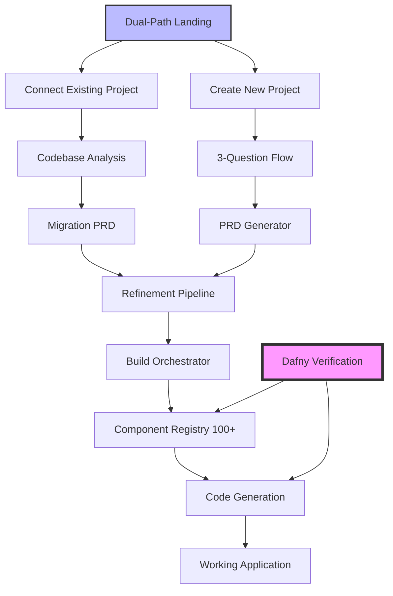

# Rainmaker 🌧️

**From PRD to Working Code in One Click - Mathematically Guaranteed**

Rainmaker is the world's first formally verified code generation platform that eliminates entire classes of bugs before they exist. We don't just generate code—we mathematically prove it's correct.

Using Dafny formal verification, we guarantee:
- Your pricing calculations will never produce negative values
- Your state machines can't enter invalid states
- Your distributed transactions will always maintain consistency
- Your generated projects will build and run on the first try

This isn't testing. This isn't "best practices." This is mathematical certainty applied to real-world software development.

## 🚀 Two Paths to Success

### Path 1: Connect Existing Project
Transform your legacy codebase into modern, verified architecture:
- Connect via GitHub or upload your project
- Automatic codebase analysis and component mapping
- Migration PRD generation with upgrade recommendations
- Maintain business logic while modernizing the stack

### Path 2: Create New Project
Build from scratch with our intelligent PRD-driven process:
- 3-question flow to capture your vision
- AI-powered PRD generation and refinement
- One-click to working code - mathematically guaranteed

```typescript
// The Magic Button - works for both paths
const result = await buildOrchestratorService.buildFromPRD({
  prd: yourFinalizedPRD,
  projectType: selectedProjectType,
  targetFramework: 'REACT'
});

// Result: Complete project with 100+ verified components
```

## 🔬 Mathematical Guarantees

Rainmaker uses formal verification to prove:

1. **Component Compatibility** - Selected components will always work together
2. **Type Safety** - Zod schemas, TypeScript, and Prisma models are perfectly aligned
3. **Build Success** - Generated projects will always build and run
4. **Optimal Selection** - The best components for your requirements, every time
5. **Business Logic Correctness** - Pricing, inventory, and financial calculations verified
6. **State Machine Safety** - Invalid state transitions are mathematically impossible
7. **Distributed Consistency** - Saga patterns with guaranteed compensation

[See the full verification system documentation](verification/RAINMAKER_VERIFICATION_SYSTEM.md)
[See the expanded verification for real-world bugs](EXPANDED_VERIFICATION_SYSTEM.md)

## 🏗️ Architecture



## 📦 Expanded Component Registry

Our mathematically verified registry includes:

- **15+ Frontend Frameworks**: Next.js, SvelteKit, Nuxt, Remix, Astro
- **20+ UI Libraries**: Mantine, Chakra UI, Ant Design, Material-UI, shadcn/ui
- **15+ State Management**: Redux Toolkit, Zustand, Jotai, XState, Pinia
- **20+ Backend Frameworks**: Express, NestJS, Fastify, Hono
- **15+ Databases & ORMs**: Prisma, Drizzle, TypeORM, Mongoose
- **10+ Testing Tools**: Vitest, Jest, Playwright, Cypress
- **10+ Auth Solutions**: NextAuth, Clerk, Auth0, Supabase Auth

Every combination is proven to work together.

## 🎯 Core Features

### 1. PRD Generation & Refinement
- AI-powered PRD creation from simple ideas
- Multi-stage refinement pipeline
- Critical question analysis
- MVP prioritization

### 2. Build Orchestration
- One-click from PRD to working code
- Intelligent component selection
- Automatic dependency resolution
- GitHub issue creation for tasks

### 3. Formal Verification
- Dafny proofs for all critical paths
- CI/CD integration for continuous verification
- Mathematical guarantees, not hopes

### 4. Component Curation
- Battle-tested libraries only
- Quality metrics enforcement
- Performance profiles
- Alternative suggestions

## 🚦 Getting Started

### Prerequisites

- Node.js 18+
- PostgreSQL (or Supabase)
- GitHub account (for issue creation)
- Anthropic API key

### Installation

```bash
# Clone the repository
git clone https://github.com/yourusername/rainmaker.git
cd rainmaker

# Install dependencies
npm install

# Set up environment variables
cp .env.example .env
# Edit .env with your API keys

# Run database migrations
cd packages/api
npx prisma migrate dev

# Start the development servers
npm run dev
```

### Quick Start

1. **Generate a PRD**:
```typescript
const prd = await prdGeneratorService.generatePRD({
  productIdea: "A task management app with AI prioritization"
});
```

2. **Refine the PRD**:
```typescript
const refined = await refinementService.refinePRD(prd);
```

3. **Build the Project** (The Magic Button):
```typescript
const result = await buildOrchestratorService.buildFromPRD({
  prd: refined,
  projectType: 'NEW_PROJECT'
});
```

4. **Get Working Code**:
- Complete project structure
- All dependencies configured
- Type-safe from day one
- Ready to customize

## 🔍 Verification

Run the formal verification suite:

```bash
cd verification
./verify-all.sh
```

This ensures:
- ✅ Component compatibility proofs pass
- ✅ Schema consistency is maintained
- ✅ Build pipeline invariants hold
- ✅ Registry quality is assured

## 📁 Project Structure

```
rainmaker/
├── packages/
│   ├── api/                    # Backend API server
│   │   ├── src/
│   │   │   ├── build/         # Build orchestration
│   │   │   ├── components/    # Component registry
│   │   │   ├── prd/          # PRD generation
│   │   │   └── refinement/   # Refinement pipeline
│   │   └── prisma/           # Database schema
│   ├── frontend/             # React UI
│   └── schema/              # Shared types
├── verification/            # Dafny formal proofs
│   ├── component-compatibility.dfy
│   ├── schema-consistency.dfy
│   ├── build-pipeline-invariants.dfy
│   └── registry-expansion-specs.dfy
└── README.md
```

## 🧪 Testing

```bash
# Run all tests
npm test

# Run verification
cd verification
./verify-all.sh

# Run specific package tests
cd packages/api
npm test
```

## 🚢 Deployment

Rainmaker is designed to be deployed as a service:

```bash
# Build for production
npm run build

# Deploy API
cd packages/api
npm run deploy

# Deploy frontend
cd packages/frontend
npm run deploy
```

## 🤝 Contributing

We welcome contributions! Please ensure:

1. All tests pass
2. Dafny verification succeeds
3. New components meet quality thresholds
4. Documentation is updated

## 📄 License

MIT License - see [LICENSE](LICENSE) file for details.

## 🙏 Acknowledgments

- **Dafny** - For making formal verification accessible
- **Anthropic Claude** - For powering our AI features
- **The Open Source Community** - For the amazing components in our registry

---

**Built with mathematical certainty by the Rainmaker team**

*"Remove the conditions that allow mistakes to occur"* - Our guiding principle
