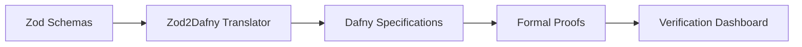

# Rainmaker - Formally Verified CRUD Framework

[Previous content remains unchanged...]

## Formal Verification

Rainmaker uses Dafny to mathematically verify critical system properties. The verification process ensures:

1. **Component Registry Integrity**:
   - No duplicate components
   - All components meet quality standards
   - Registry invariants are maintained

2. **Validation Layer Correctness**:
   - Field name validation against reserved words
   - Proper identifier patterns
   - Supported Zod types

### Verification Workflow



### Running Verification

```bash
# Verify component registry
cd verification
./verify_component_registry.sh

# Expected output:
# ⏳ Verifying Component Registry specifications...
# ✅ Verification completed successfully
# 📄 Report generated: verification_report.md
```

### Verification Reports

Reports include:
- Verification status (pass/fail)
- Proof obligations
- Quality metrics
- Runtime statistics

Example report:
```markdown
# Component Registry Verification Report
Generated: 2025-05-30

## Verification Results
- ✅ Component validity checks passed
- ✅ Registry invariants maintained  
- ✅ No duplicate components detected

## Quality Metrics
- Verification Time: 2.4s  
- Proof Obligations: 18
- Verified: 18/18 (100%)
```

### CI Integration

Verification runs automatically on:
- Every push to main
- Every pull request
- Scheduled nightly builds

Reports are available as CI artifacts.

## Development

[Rest of existing content...]
